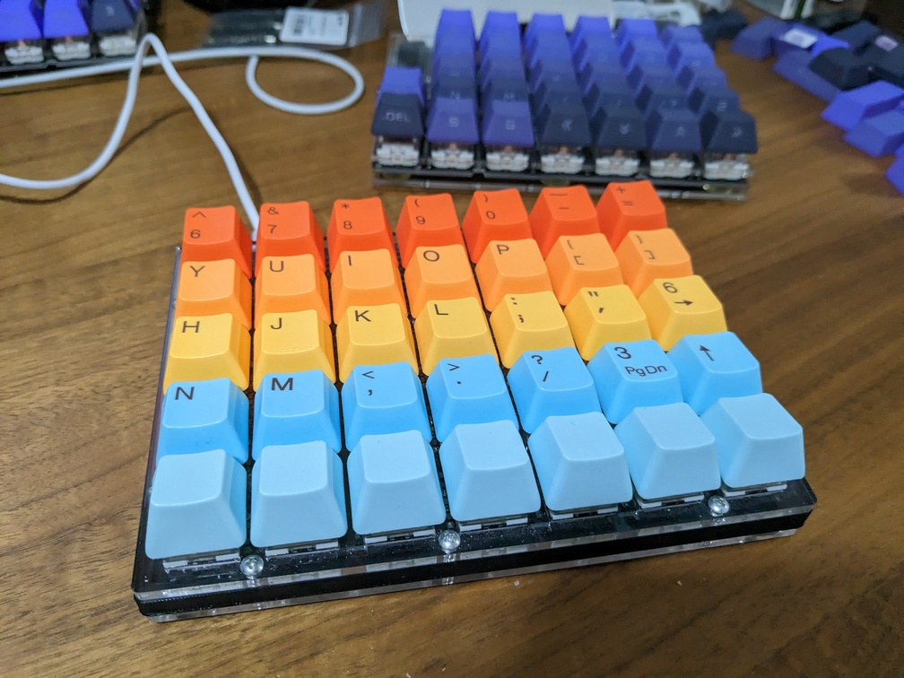
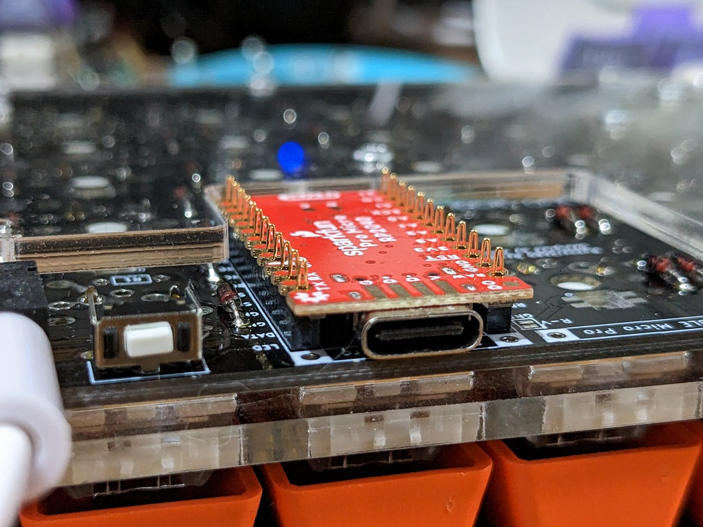
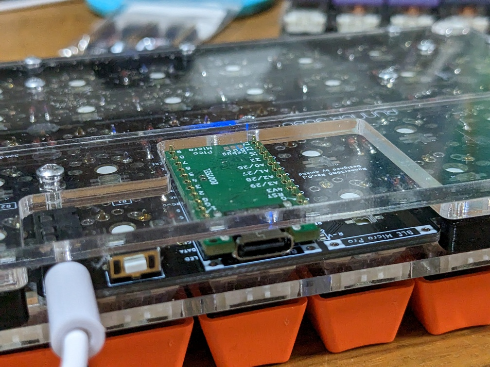
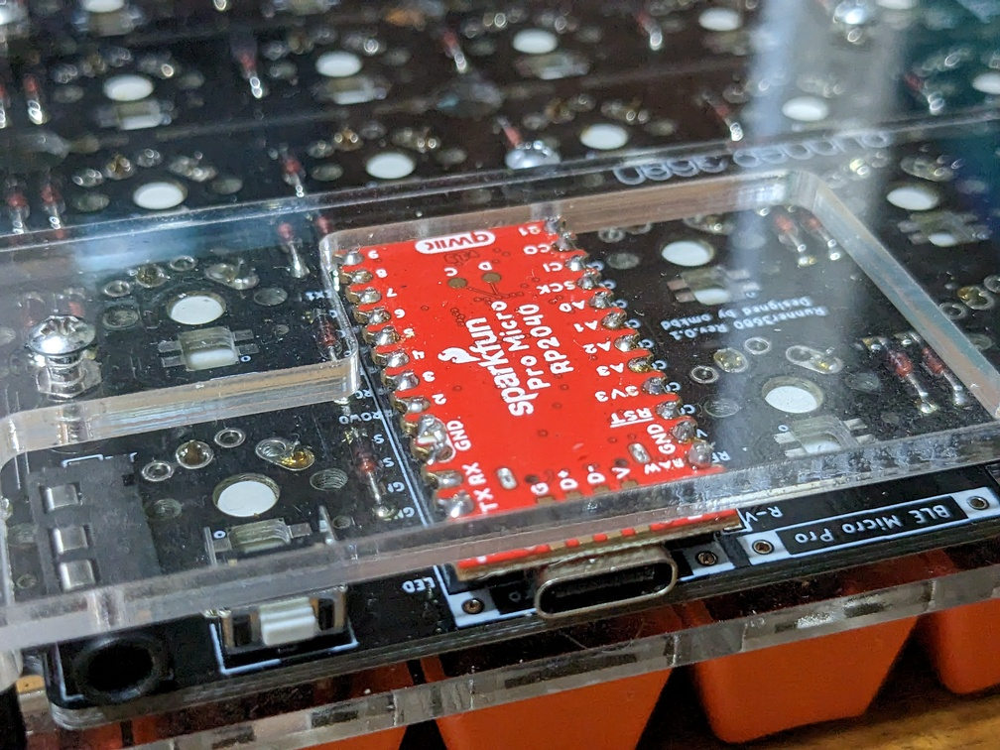

# Why are number keys important?

author
:   Shugo Maeda

# Do you have number keys?

# My keyboard

{:relative_height='100'}

# My keyboard specs

* Runner3680
* SparkFun Pro Micro RP2040
* Kailh Box Brown
* Tai-Hao Hawaii PBT double shot
* Modified PRK Firmware 0.9.20

# Runner3680

* Split Ortholinear Keyboard 
* Flexible layout
    * 4-5 rows x 6-8 columns
    * mine is 5 rows x 7 columns

# Why SparkFun Pro Micro?

* PRK Firmware 0.9.20 doesn't work with Pico Micro
* Software UART issue

# Problem of SparkFun

{:relative_height='100'}

# Pico Micro was fine

{:relative_height='100'}

# Solved by soldering

{:relative_height='100'}

# T-Code

* Kanji direct input method
* No kana-kanji conversion
* Two stroke points one kanji code
    * e.g., lb → 前, jb → 田
    * 40 * 40 = max 1600 characters

# Keys for T-Code

|1|2|3|4|5|6|7|8|9|0|
|Q|W|E|R|T|Y|U|I|O|P|
|A|S|D|F|G|H|J|K|L|;|
|Z|X|C|V|B|N|M|,|.|/|

# If you have no number keys

* You have no dream
* 3l → 夢

# T-Code implementation

* tc2 for Emacs
* Custom romaji table for mozc
* TCodeInputMethod for Textbringer

# T-Code on PRK Firmware

* You can use T-Code everywhere

# How to input kanji

* IBus
    * Intelligent Input Bus
    * Input method framework for Unix
* Unicode input on IBus
    * Ctrl+Shift+u 3042 Space → あ(U+3042)

# T-Code table

* 1600 * 2 bytes
* Too large for keymap.rb
* Modify PRK Firmware to store the table in ROM

# tcode_table

```c
static const uint16_t __in_flash() tcode_table[1600] = {
  0x25A0, 0x25A0, 0x25A0, 0x25A0, ...
};  
/*
 * To avoid cache because it's inefficient for random accesss
 * https://forums.raspberrypi.com/viewtopic.php?t=319837#p1915273
 */
static const uint16_t *tcode_table_uncached =
  (const uint16_t *)((size_t) tcode_table + 0x03000000);
```

# tcode_table_aref()

```c
static void
tcode_table_aref(mrbc_vm *vm, mrbc_value *v, int argc)
{
  int index = GET_INT_ARG(1);
  if (0 <= index && index < 1600) {
    uint16_t codepoint = tcode_table_uncached[index];
    char buf[4];
    for (int i = 0; i < 4; i++) {
      buf[i] = hex_digits[codepoint >> 4 * (3 - i) & 0x000F];
    }
    mrbc_value value = mrbc_string_new(vm, buf, 4);
    SET_RETURN(value);
  }
  else {
    SET_NIL_RETURN();
  }
}
```

# prk_init_TcodeTable()

```c
void
prk_init_TcodeTable(void)
{
  mrbc_class *mrbc_class_TcodeTable =
    mrbc_define_class(0, "TcodeTable", mrbc_class_object);
  mrbc_define_method(0, mrbc_class_TcodeTable, "[]", tcode_table_aref);
}
```

# T-Code layer

```ruby
kbd.add_layer :tcode, %i[
    KC_ESCAPE   KC_GRAVE   KC_TC     KC_TC     KC_TC     KC_TC     KC_TC...
    KC_TAB   KC_TAB   KC_TC     KC_TC     KC_TC     KC_TC     KC_TC...
    KC_LCTL  KC_LCTL  KC_TC     KC_TC     KC_TC     KC_TC     KC_TC...
    KC_PGUP  KC_LSFT  KC_TC     KC_TC     KC_TC     KC_TC     KC_TC...
    KC_PGDOWN  ADJUST   KC_LGUI  KC_LALT  KC_LGUI  LOWER    KC_SPACE...
]
```

# T-Code key indices

|0|1|2|3|4|5|6|7|8|9|
|10|11|12|13|14|15|16|17|18|19|
|20|21|22|23|24|25|26|27|28|29|
|30|31|32|33|34|35|36|37|38|39|

# row/column to index

```ruby
class Keyboard
  attr_reader :switches # [[row, column], [row, column]..]
end

tc_index = nil

kbd.before_report do
  if switch = kbd.switches.last
    tc_index = 10 * switch[0] + switch[1] - 2
  end
end
```

# Kanji input

```ruby
tcode = Proc.new {
  if prev_tc_index
    i = 40 * tc_index + prev_tc_index
    if codepoint = TCODE_TABLE[i]
      kbd.send_key(:KC_LCTL, :KC_LSFT, :KC_U)
      kbd.macro(codepoint + " ", [])
    end
    prev_tc_index = nil
  else
    prev_tc_index = tc_index
  end
}
kbd.define_mode_key :KC_TC, [ tcode, nil, 300, nil ]
```

# Demo

# Conclusion

* NO NUMBER KEYS, NO DREAM
